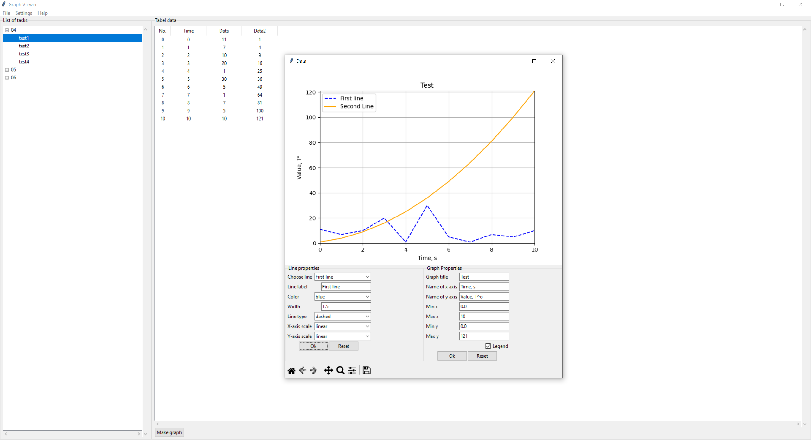

# Graph Viwer
Graph Viwer is a graphical interface for viewing data generated by calculations using the [SOCRAT](https://en.ibrae.ac.ru/contents/370) program code and creating graphs based on this data.
Using this application, you can also edit the resulting graphs and save them in a convenient format for further use.
This app was designed on the basis of MVC pattern and with the help of **Python GUI Programming with Tkinter** by Alan D. Moore.
## Limitations:
- The maximum number of lines on one graph is *24*;
- Only files with the extension *.dia* used in SOCRAT can be opened

